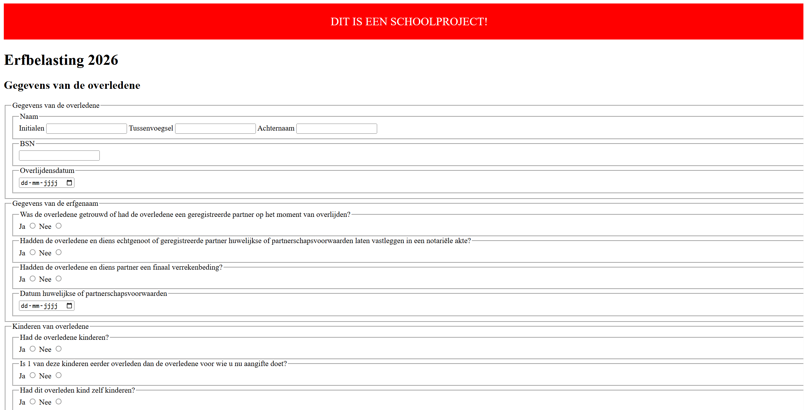
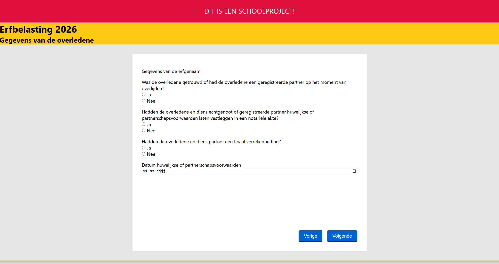

# Melvin-Web_BT
Website voor het vak Browser Technologies

## Week 1

### Dag 1: Maandag 16 - 2 -2026
Vandaag zijn we begonnen met het project. We moeten 2 onderdelen namaken van het formulier van het erfbelasting formulier. Deze moeten we beter en hopelijk leuker maken. Mijn idee is dat je per onderdeel een losse "pagina" hebt. Het is allemaal 1 html bestand, maar met translates kan ik ze per stuk in beeld laten komen, en kan ik delen laten overslaan als je dat over mag slaan. We begonnen met een kick-off en een workshop die samen 2,5 uur duurde. Hier had ik voornamelijk geleerd over fieldsets en legend html elementen. Hier had ik nog niet eerder mee gewerkt. Toen we zelf aan het werkt konden ben ik hier dan ook meteen mee verder gaan werken. We moeten in ieder geval pagina 1 van het formulier doen. Hier kwam ik redelijk makkelijk doorheen. Ik moet alleen later nog even beter kijken naar alle attributen. Ik had wel al een beetje gekeken naar verschillende attributen en een pattern laten creeëren door AI. Deze staan hieronder vermeld. Pagina 1 van het formulier duurde ongeveer 2 uur om te maken. Ik heb ook nog even gekeken naar welk ander onderdeel ik wilde gaan doen in mijn website. Het leek me leuk om een onderdeel te doen waarbij je moet in kunnen vullen voor hoeveel mensen het gaat, dus dat je 1 stuk formulier laat zien, en extra mensen kan toevoegen. Dit kwam in verschillende onderdelen voor, voornamelijk stuk 3, 4 en 5. Hierin was 3 het korste. Dan heb ik meer tijd om te kunnen focussen op stijl, responsiveness en functionaliteit.

 

#### Bekeken websites
https://developer.mozilla.org/en-US/docs/Web/HTML/Reference/Elements/input#attr-pattern
https://developer.mozilla.org/en-US/docs/Web/HTML/Reference/Elements/input/date
https://developer.mozilla.org/en-US/docs/Web/HTML/Reference/Elements/input/radio

#### AI hulp
Prompt: Give me an html input pattern for a type=text so that only 9 numbers can get added in that text field
Resultaat:
```
<input type="text" pattern="^\d{9}$" maxlength="9" required>
```
Ik heb hier alleen nog een minlength aan toegevoegd en nog wat extra uitleg gevraagd over wat elk onderdeel in de pattern betekent. \d staat voor dat het alleen getallen mogen zijn, ^ staat voor begin van de input, {9} staat voor de hoeveelheid getallen en $ voor het einde van een input. In mijn geval voor het bsn nummer heb ik ^ en $ eraf gehaald.

#### Checkout met Mats
Ik kan alvast een beetje padding toevoegen voor overzicht in de huidige versie van mijn website, maar niet voor mijn uiteindelijke versie. Plus ik had nog even geleerd over het mark element in html code, dat geeft overzicht in mijn html door gewoon MARK: te typen. Dat kan helpen in het overzicht in mijn code en snel naar het juiste punt springen.

### Weekly Geek: It’s hard to justify Tahoe icons
Bron: https://tonsky.me/blog/tahoe-icons/<br>

"The number of elements and their behaviours should be limited". Je wilt dus kort en duidelijk uitleg geven over bepaalde interacties. Zo hadn macOS in 2025 dus heel veel extra icoontjes toegevoegd aan teksten die al duidelijk genoeg waren. Icoontjes zouden namelijk moeten helpen om dingen snel te vinden, maar als alles een icoontje heeft, helpt het niks.<br>
Icoontjes moeten uniek zijn aan hun functie. Je wilt niet 2 verschillende functies hetzelfde icoon geven. Als een icoontje net iets anders is, kunnen we er nog steeds vanuit gaan dat het hetzelfde zou moeten beteken, en het is ook lastig om voor ALLES een uniek icoon te gebruiken. Kleine verschillende in icoontjes zouden ook niet te veel gebruikt moeten worden. Van veraf kan je net aan herkennen dat sommige icoontjes anders zijn, maar het is niet duidelijk genoeg dat het helpt om snel onderscheid te maken.<br><br>
Er zijn ook wel icoontjes die sneller duidelijk zijn dan sommige text lezen, als je de context al weet. Zoals in het voorbeeld van in welke hoek je een window wilt hebben.
<br><br>
Iconen moeten meteen duidelijk zijn, het helpt dus om voorbeelden te gebruiken van dingen uit het echte lezen. Zoals een map om documenten op te slaan. Of een vergrootglas om in te zoomen. Of een icoon dat op een andere OS al werkt.
<br><br>
Niet elke actie heeft een duidelijk icoon dat er aan gekopppeld kan worden. Maar het is dan beter om er geen icoon aan toe te voegen. Je zou aan de hand van het icoon, zonder tekst, moeten kunnen herkennen wat de actie is.
<br><Br>
Het is handig als iconen een tegenovergestelde versie hebben, als je er dan namelijk eentje leert, snap je een andere ook meteen. Als undo en redo, export en import. Die hebben allemaal een tegenhanger waarbij in het icoon het meteen duidelijk is dat het een tegenhanger is.
<br><br>
Het is meestal niet al te best om tekst te gebruiken in een icoon. In ieder geval vroeger niet. Het kan wel werken in sommige gevallen, zoals voor dikgedrukt, schuingedrukt om onderstreept. Maar dan is het vooral de context van andere icoontjes die je het helpt begrijpen. Want als je alleen ABC hebt staan zou het niet perse duidelijk zijn dat het puur om hoofdletters gaat, vooral als dingen zoals Aa ook bestaan.
<br><br>
Een andere fout in Tahoe is hoe icoontjes die al bestaan voor UI interacties, die ook gebruikt worden voor andere acties, is niet handig. Verward meer dan dat het helpt.
<br><br>
Het handige in pop-up lijstjes met teksten is dat je vaak gewoon de eerste letter van de woorden kan scannen om de juiste actie te vinden. Maar in sommige gevallen in Tahoe krijgen sommige wel een icoon en andere niet. Dit zorgt ervoor dat niet elke tekst links is uitgelijnd en dat het dus moeilijker scannen wordt.
<br><br>
Interfaces moeten werken voor mensen, niet voor computers. Mensen krijgen niet elk jaar een nieuwe update om nieuwe informatie op te slaan. We zijn aan dingen gewend en zouden dat graag terug willen zien in designs.

## Dag 2: Dinsdag 17 - 2 -2026
Vandaag waren we begonnen met de weekly geek te bespreken door middel van een wooclap. Hier viel het vooral op dat er bijna niks over specifiek de inhoud ging, maar vooral over de betrouwbaarheid van de bron. Hier moet ik dus bij de volgende weekly geek meer op letten. Dit bespreken duurde ongeveer 45 minuten. Daarna ging ik verder aan mijn HTML met het toevoegen van deel 3 uit het erfbelasting formulier. Het toevoegen daarvan duurde ongeveer 1,5 uur. Daarna ben ik ook nog even mijn HTML doorgelopen en de layout een beetje aangepast zodat hij beter zou werken voor de screenreader en meer consistent is. Dit duurde nog ongeveer een uur. Daarna was ik bezig geweest met het stylen van de buttons voor next en previous. Hiervoor had ik van de website van de NS gekeken hoe zij de button hadden gestyled. Ik had dit ook even met Vasilis besproken, dat voor responsiveness het niet het beste was om alles over te nemen, maar dat voor bijvoorbeeld een button het best kan om de huisstijl over te nemen. Dit stylen duurde ongeveer 30 min. Daarna heb ik gewerkt aan de functionaliteit van de prev en next buttons. Hier kwam ik redelijk goed uit. Ik had wel inspiratie genomen van een website van w3schools. De link daarna toe staat in het kopje 'Bekeken websites'. Dit werkend krijgen duurde ongeveer 30 minuten. Daarna ben ik nog verder gegaan het aan het stylen en responsive maken van mijn form. Ik probeerde nu minder afhankelijk te zijn van media queries. Ik had het zo gedaan dat de form een width van 95% krijgt, maar ook een max-width. Op die manier is hij op mobiel een standaard formaat en anders heeft hij een standaard breedte. Dit stylen duurde ongeveer 1,5 uur.



### Bekeken websites
https://www.ns.nl/?utm_source=google&utm_medium=Paid_Search&utm_campaign=NSR-CORP-BR-corporate_C13090&utm_content=&utm_term=ns&utm_id=google_ads_16495705419&gad_source=1&gad_campaignid=16495705419&gbraid=0AAAAADPhMsdFM9X0aDbt-uVlAm0xCiJis&gclid=CjwKCAiAwNDMBhBfEiwAd7ti1JzSFy1babL4UMYozV751sv8AwSPa_cla5f79mxyneg3VEzVRzMM6RoC-mwQAvD_BwE
https://www.w3schools.com/howto/howto_js_form_steps.asp