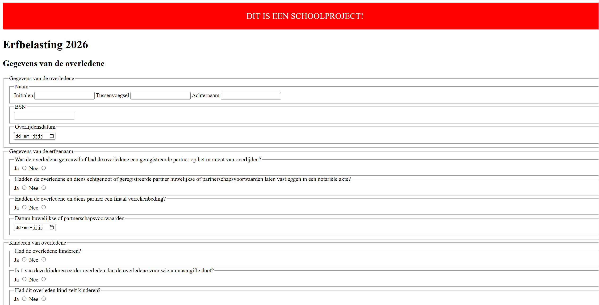
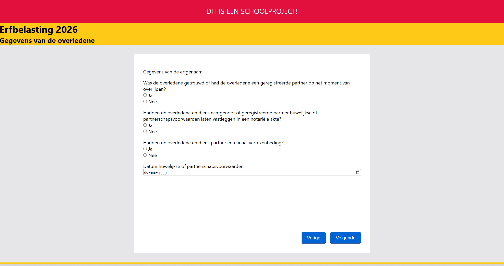
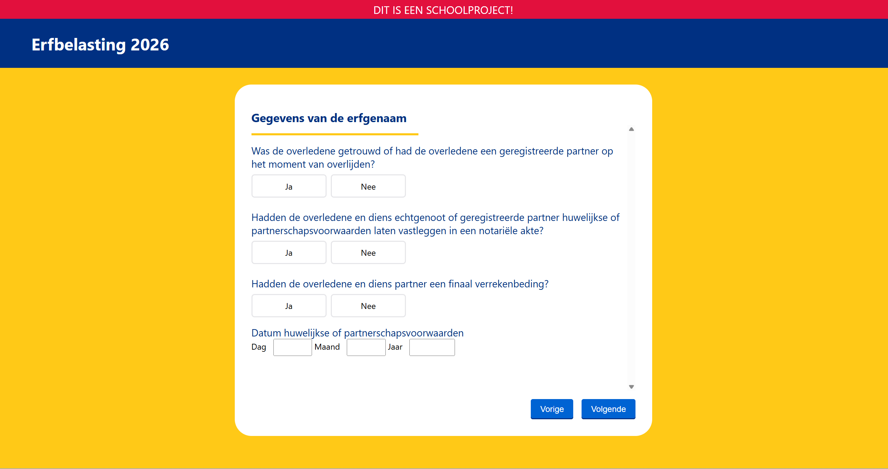
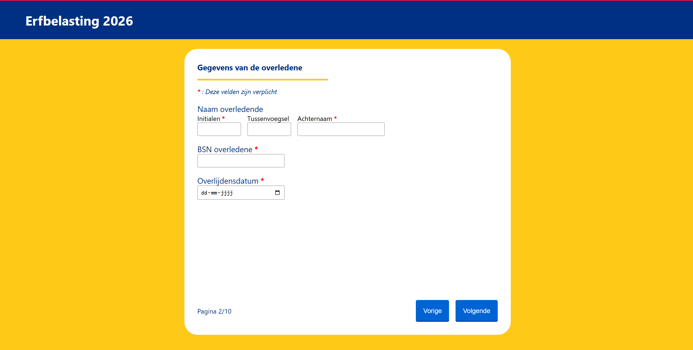
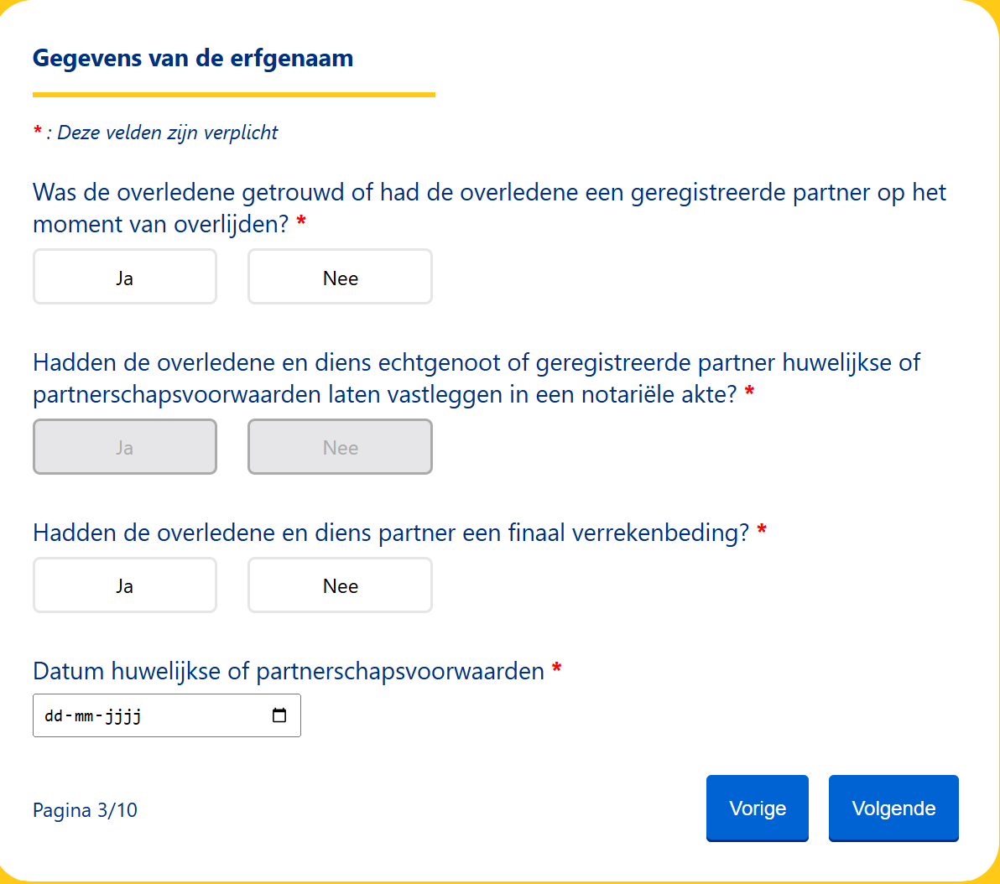

# Melvin-Web_BT
Website voor het vak Browser Technologies

DIT IS EEN OPDRACTT VOOR SCHOOL

## Week 1

### Dag 1: Maandag 16 - 2 - 2026
Vandaag zijn we begonnen met het project. We moeten 2 onderdelen namaken van het formulier van het erfbelasting formulier. Deze moeten we beter en hopelijk leuker maken. Mijn idee is dat je per onderdeel een losse "pagina" hebt. Het is allemaal 1 html bestand, maar met translates kan ik ze per stuk in beeld laten komen, en kan ik delen laten overslaan als je dat over mag slaan. We begonnen met een kick-off en een workshop die samen 2,5 uur duurde. Hier had ik voornamelijk geleerd over fieldsets en legend html elementen. Hier had ik nog niet eerder mee gewerkt. Toen we zelf aan het werkt konden ben ik hier dan ook meteen mee verder gaan werken. We moeten in ieder geval pagina 1 van het formulier doen. Hier kwam ik redelijk makkelijk doorheen. Ik moet alleen later nog even beter kijken naar alle attributen. Ik had wel al een beetje gekeken naar verschillende attributen en een pattern laten creeëren door AI. Deze staan hieronder vermeld. Pagina 1 van het formulier duurde ongeveer 2 uur om te maken. Ik heb ook nog even gekeken naar welk ander onderdeel ik wilde gaan doen in mijn website. Het leek me leuk om een onderdeel te doen waarbij je moet in kunnen vullen voor hoeveel mensen het gaat, dus dat je 1 stuk formulier laat zien, en extra mensen kan toevoegen. Dit kwam in verschillende onderdelen voor, voornamelijk stuk 3, 4 en 5. Hierin was 3 het korste. Dan heb ik meer tijd om te kunnen focussen op stijl, responsiveness en functionaliteit.

 

#### Bekeken websites
https://developer.mozilla.org/en-US/docs/Web/HTML/Reference/Elements/input#attr-pattern
https://developer.mozilla.org/en-US/docs/Web/HTML/Reference/Elements/input/date
https://developer.mozilla.org/en-US/docs/Web/HTML/Reference/Elements/input/radio

#### AI hulp
Prompt: Give me an html input pattern for a type=text so that only 9 numbers can get added in that text field
Resultaat:
```
<input type="text" pattern="^\d{9}$" maxlength="9" required>
```
Ik heb hier alleen nog een minlength aan toegevoegd en nog wat extra uitleg gevraagd over wat elk onderdeel in de pattern betekent. \d staat voor dat het alleen getallen mogen zijn, ^ staat voor begin van de input, {9} staat voor de hoeveelheid getallen en $ voor het einde van een input. In mijn geval voor het bsn nummer heb ik ^ en $ eraf gehaald.

#### Checkout met Mats
Ik kan alvast een beetje padding toevoegen voor overzicht in de huidige versie van mijn website, maar niet voor mijn uiteindelijke versie. Plus ik had nog even geleerd over het mark element in html code, dat geeft overzicht in mijn html door gewoon MARK: te typen. Dat kan helpen in het overzicht in mijn code en snel naar het juiste punt springen.

### Weekly Geek 1: It’s hard to justify Tahoe icons
Bron: https://tonsky.me/blog/tahoe-icons/<br>

"The number of elements and their behaviours should be limited". Je wilt dus kort en duidelijk uitleg geven over bepaalde interacties. Zo hadn macOS in 2025 dus heel veel extra icoontjes toegevoegd aan teksten die al duidelijk genoeg waren. Icoontjes zouden namelijk moeten helpen om dingen snel te vinden, maar als alles een icoontje heeft, helpt het niks.<br>
Icoontjes moeten uniek zijn aan hun functie. Je wilt niet 2 verschillende functies hetzelfde icoon geven. Als een icoontje net iets anders is, kunnen we er nog steeds vanuit gaan dat het hetzelfde zou moeten beteken, en het is ook lastig om voor ALLES een uniek icoon te gebruiken. Kleine verschillende in icoontjes zouden ook niet te veel gebruikt moeten worden. Van veraf kan je net aan herkennen dat sommige icoontjes anders zijn, maar het is niet duidelijk genoeg dat het helpt om snel onderscheid te maken.<br><br>
Er zijn ook wel icoontjes die sneller duidelijk zijn dan sommige text lezen, als je de context al weet. Zoals in het voorbeeld van in welke hoek je een window wilt hebben.
<br><br>
Iconen moeten meteen duidelijk zijn, het helpt dus om voorbeelden te gebruiken van dingen uit het echte lezen. Zoals een map om documenten op te slaan. Of een vergrootglas om in te zoomen. Of een icoon dat op een andere OS al werkt.
<br><br>
Niet elke actie heeft een duidelijk icoon dat er aan gekopppeld kan worden. Maar het is dan beter om er geen icoon aan toe te voegen. Je zou aan de hand van het icoon, zonder tekst, moeten kunnen herkennen wat de actie is.
<br><Br>
Het is handig als iconen een tegenovergestelde versie hebben, als je er dan namelijk eentje leert, snap je een andere ook meteen. Als undo en redo, export en import. Die hebben allemaal een tegenhanger waarbij in het icoon het meteen duidelijk is dat het een tegenhanger is.
<br><br>
Het is meestal niet al te best om tekst te gebruiken in een icoon. In ieder geval vroeger niet. Het kan wel werken in sommige gevallen, zoals voor dikgedrukt, schuingedrukt om onderstreept. Maar dan is het vooral de context van andere icoontjes die je het helpt begrijpen. Want als je alleen ABC hebt staan zou het niet perse duidelijk zijn dat het puur om hoofdletters gaat, vooral als dingen zoals Aa ook bestaan.
<br><br>
Een andere fout in Tahoe is hoe icoontjes die al bestaan voor UI interacties, die ook gebruikt worden voor andere acties, is niet handig. Verward meer dan dat het helpt.
<br><br>
Het handige in pop-up lijstjes met teksten is dat je vaak gewoon de eerste letter van de woorden kan scannen om de juiste actie te vinden. Maar in sommige gevallen in Tahoe krijgen sommige wel een icoon en andere niet. Dit zorgt ervoor dat niet elke tekst links is uitgelijnd en dat het dus moeilijker scannen wordt.
<br><br>
Interfaces moeten werken voor mensen, niet voor computers. Mensen krijgen niet elk jaar een nieuwe update om nieuwe informatie op te slaan. We zijn aan dingen gewend en zouden dat graag terug willen zien in designs.

## Dag 2: Dinsdag 17 - 2 -2026
Vandaag waren we begonnen met de weekly geek te bespreken door middel van een wooclap. Hier viel het vooral op dat er bijna niks over specifiek de inhoud ging, maar vooral over de betrouwbaarheid van de bron. Hier moet ik dus bij de volgende weekly geek meer op letten. Dit bespreken duurde ongeveer 45 minuten. Daarna ging ik verder aan mijn HTML met het toevoegen van deel 3 uit het erfbelasting formulier. Het toevoegen daarvan duurde ongeveer 1,5 uur. Daarna ben ik ook nog even mijn HTML doorgelopen en de layout een beetje aangepast zodat hij beter zou werken voor de screenreader en meer consistent is. Dit duurde nog ongeveer een uur. Daarna was ik bezig geweest met het stylen van de buttons voor next en previous. Hiervoor had ik van de website van de NS gekeken hoe zij de button hadden gestyled. Ik had dit ook even met Vasilis besproken, dat voor responsiveness het niet het beste was om alles over te nemen, maar dat voor bijvoorbeeld een button het best kan om de huisstijl over te nemen. Dit stylen duurde ongeveer 30 min. Daarna heb ik gewerkt aan de functionaliteit van de prev en next buttons. Hier kwam ik redelijk goed uit. Ik had wel inspiratie genomen van een website van w3schools. De link daarna toe staat in het kopje 'Bekeken websites'. Dit werkend krijgen duurde ongeveer 30 minuten. Daarna ben ik nog verder gegaan het aan het stylen en responsive maken van mijn form. Ik probeerde nu minder afhankelijk te zijn van media queries. Ik had het zo gedaan dat de form een width van 95% krijgt, maar ook een max-width. Op die manier is hij op mobiel een standaard formaat en anders heeft hij een standaard breedte. Dit stylen duurde ongeveer 1,5 uur. Na de vakantie wilde ik verder gaan met validatie, want Vasilis had verteld dat hij daar uitleg over zou geven. Vandaag heb ik verder geoefend met dingen zoals index in javascript, en met de inputs.



### Bekeken websites
https://www.ns.nl/?utm_source=google&utm_medium=Paid_Search&utm_campaign=NSR-CORP-BR-corporate_C13090&utm_content=&utm_term=ns&utm_id=google_ads_16495705419&gad_source=1&gad_campaignid=16495705419&gbraid=0AAAAADPhMsdFM9X0aDbt-uVlAm0xCiJis&gclid=CjwKCAiAwNDMBhBfEiwAd7ti1JzSFy1babL4UMYozV751sv8AwSPa_cla5f79mxyneg3VEzVRzMM6RoC-mwQAvD_BwE<br>
https://www.w3schools.com/howto/howto_js_form_steps.asp

### Checkout met Luna Jay
Was cool dat ik buttons had om het op verschillende pagina's te doen en dat die styling was overgenomen van de NS stijl. Het ziet er goed uit hoe je eigenlijk niet hoeft te scrollen om het complete formulier te zien en dat het dus opgedeeld is in verschillende secties.

## Week 1 verslag
Deze week heb ik een goed begin gemaakt aan mijn formulier over de erfbelasting in de stijl van de NS. Om makkelijk te beginnen ben ik eerst gaan kijken naar de verschillende kleuren van de NS en die even in root op te slaan. Dit was uiteraard snel gedaan dus ging ik daarna meteen aan de form werken. Ik had als idee om het een beetje in de stijl van de Nationale Studenten Enquete te doen. Dat je op 1 pagina maar een gelimiteerd hoeveelheid vragen tegelijk ziet en dat je op die manier door het complete formulier gaat. We kregen als opdracht dat we 2 patterns moesten doen. De eerste was al gegeven op pagina 1 van de erfbelasting. Daarin moest je kijken dat als er iets specifieks is ingevuld dat je dat andere vragen mag overslaan. Dit leek me inderdaad interessant om naar te kijken omdat je dan moet kijken of een checkbox/radio button gecheckt is. De eerste dag was ik vooral bezig met dat gedeelte van de form netjes in HTML te maken door middel van fieldsets en legends. Dit waren HTML elementen die ik nog niet eerder had gebruikt voor forms en goed werken voor screenreaders. Waar 1 van mijn leerdoelen over ging. Dus dat was meteen een plus punt. De tweede dag ben ik daar dan ook verder mee gegaan met een ander onderdeel uit het formulier. Ik had gekozen om onderdeel 3 te doen. Hier kwam namelijk een pattern in voor dat je moest aangeven over hoeveel mensen het ging en dat je per persoon dingen moest invullen. Dit leek me een leuke pattern om mee te werken omdat je dan ook moet kijken naar een specifieke waarde en aan de hand daarvan het formulier langer moet maken. De HTML hiervoor had ik nu iets sneller voor elkaar, dus kon ik ook alvast een beetje kijken naar styling en JavaScript. De javascript om ervoor te zorgen dat je door middel van knoppen door het formulier heen kwam had ik sneller dan verwacht werkend en hoefde ik alleen nog maar een beetje te tweaken dat bijvoorbeeld de "Previous" button niet te zien is op het eerste gedeelte en dat de "Next" button een submit knop wordt op het laatste gedeelte van het formulier. De rest van de functionaliteit van het formulier ga ik later aan werken. Ik wilde eerst een beetje gaan stylen. Op de website van de NS had ik een button gevonden met een hover state. Deze kon ik vrij makkelijk uit de inspector halen en direct op mijn eigen buttons zetten. Ik had niet alle properties nodig dus het was een beetje puzzelen. Voor de rest heb ik tot nu toe alleen nog wat achtergronden een kleur gegeven zodat het meer de stijl van de NS werd. De rest van de styling, functionaliteiten en valideren doe ik na de vakantie.

### Voortgangsgesprek week 1
Ik had mijn voortgangsgesprek met Victor. Tijdens het gesprek zag ik een paar mooie voorbeelden van medestudenten die al meer met CSS en styling hadden gedaan. Dus daar kon ik goede inspiratie uit nemen. Voor mijn eigen werk had Victor vooral de tip om even te kijken wat er gebeurt als mijn JavaScript uit staat. In mijn geval zie je namelijk nu helemaal niks meer van het formulier, omdat ik standaard alles op display: none heb staan. Hier moet ik dus even een iets andere aanpak voor gebruiken. Voor de rest was het inderdaad handig als ik per stap dingen ga valideren van of alles ingevuld in plaats van het hele document in 1 keer. En dat ik met een screenreader kan checken waar de focus ligt als je bijvoorbeeld op een button zit.

## Week 2

### Dag 3: Maandag 2 - 3 - 2026
Vandaag was ik begonnen met nog even mijn readme bestanden aanvullen van BT en CSS van de voortgangsgesprekken van voor de voorjaarsvakantie. Daarna begonnen we de les met een workshop over validatie. Hier had ik vooral geleerd over het title attribute in HTML waarmee je soms het error/warning tekstje kan veranderen op een input element. Het meeste dat ik vandaag had geleerd kwam van de CSS selectors. Zoals hoe je :hover kan gebruiken met een input die genest is in een label. Maar vooral over andere selectoren zoals het attribute selector maar ook :checked, :disabled, :invalid / :valid en :user-invalid / :user-valid. Dit was de basis uitleg over validatie. Waarin je vooral de styling van dingen kan aanpassen en voor de rest kan werken met required. Voor mijn huidige setup voor mijn project heb ik meer de javascript uitleg nodig. Dus daar zal ik morgen voor kijken met de workshop van Victor. Deze workshop duurde ongeveer 1 uur. Daarna ben ik gaan kijken naar progressive enchancement. Op het moment was het namelijk zo dat als mijn javascript bestand niet goed in laad, dat je dan helemaal niks meer ziet. Wat uiteraard niet goed is. Dus moest ik mijn code een beetje veranderen zodat niet elke stap standaard een display:none heeft, maar dat ze die krijgen via de javascript. Dan is namelijk standaard nog steeds alles te zien. Dit duurde ongeveer 1 uur.<br>
Vandaag ben ik ook gaan kijken naar de functionaliteit van mijn patterns. Als eerste die van pattern 1. Deze was een stukje makkelijker. Aangezien ik nu wist hoe ik met input selectoren kon werken, was het me gelukt om te checken of een bepaalde input een bepaalde waarde had. Aan de hand van die waarde kon ik een div laten animeren. Voor nu had ik het zo gemaakt dat de max-height naar 0 gaat en dat de opacity naar 0 gaat als hij "inklapt", en uiteraard ook weer gereset wordt. Dit duurde niet heel lang. Ongeveer 1,5 uur. Ik had voor deze manier gekozen omdat het dan delen weghaalt en compleet niet meer laat zien in het document, waardoor er een last van de user af gaat. Ik had het ook andersom kunnen doen met dat er meer informatie bij komt, maar dat leek me juist minder motiverend om in te vullen. Ik had ook inplaats van het helemaal weghalen het ook alleen een lagere opacity kunnen geven of het disablen. Maar dat zou niet goed werken voor slechtziende omdat het contrast dan minder wordt.<br>
Pattern 2 had wat meer gedoe. Dit ging over het gedeelte dat je kan invullen hoeveel erfgenamen er zijn en dat aan de hand daarvan het formulier verandered. In eerrste instantie had ik dit aan ChatGPT gevraagd. Ik had gevraagd of hij een stukje code kon dupliceren en in kon voegen. Hier ben ik meerdere prompts mee bezig geweest maar niks wilde lukken, vanaf een bepaald moment ging het meer kapot dan dat het beter werd. Dylan had een soortgelijk iets. Hij had een template element om zijn stuk code gedaan dat gekopieerd moest worden. Toen ik het opnieuw in een nieuwe chat van ChatGPT vroeg. Werkte het vrijwel meteen. Ik moest alleen nog even toevoegen dat de legend correct werd aangepast en dat ze op de juiste plek in mijn steps kwamen. Dit duurde 2,5 uur om dit te laten werken. Als laatste vandaag ben ik een uur bezig geweest met onderzoek naar Radio buttons, checkboxes en labels voor de Weekly Geek.

### Daily Checkout met Aya A.
De checkout had ik samen met Aya A. Zij had toevallig dezelfde patterns als mij gekozen. Zij had een andere oplossing voor de hoeveelheid verkrijgers gekozen. Zij had een buttons waarmee je meer verkrijgers kon toevoegen. Hier heb ik zelf ook aan zitten denken, maar dit zou minder goed werken in het design dat ik had met meerdere pagina's. Maar het was wel goed om even te kijken hoe andere mensen naar datzelfde probleem aankijken.

### Weekly Geek 2: UX of HTML
Bronnen:
https://developer.mozilla.org/en-US/docs/Web/Accessibility/ARIA/Reference/Roles/checkbox_role <br>
https://developer.mozilla.org/en-US/docs/Web/Accessibility/ARIA/Reference/Roles/radio_role <br>
https://developer.mozilla.org/en-US/docs/Web/HTML/Reference/Elements/input/checkbox <br>
https://developer.mozilla.org/en-US/docs/Web/HTML/Reference/Elements/input/radio <br>
https://developer.mozilla.org/en-US/docs/Web/HTML/Reference/Elements/label <br>

#### Checkbox Role
Interactief controls, hebben een attribute dat ervoor zorgt dat de waarde bekend is voor assistent technology. Een checkbox kan alleen aan of uit staan, maar voor assistent software kan het ook nog gemixt zijn. Moet gefocust kunnen worden en werken met keyboard. Tabindex gebruiken om focusable te maken. Activeren van de checkbox met spatiebalk. Aria-checked dynamisch aanpassen. Een checkbox moet gecombineerd kunnen worden met een stuk tekst. Voor javascript heeft een een onclick nodig en een onKeyDown. onclick voor de muis, onKeyDown voor spatiebalk zodra hij gefocust is. 

#### Checkbox Input
Value = moet een waarde hebben dat door wordt gegeven aan de server, is speciaal als het gaat om checkboxes. Maar standaard geeft het een string "on"<br>
Checked = of de checkbox wel of niet al gecheckt begint.<br>
Switch = maakt van de checkbox een aan/uit knop, veranderd de look. Werkt nog steeds hetzelfde.<br>
Als de checkbox genest is in een label, wordt het label ook klikbaar voor de checkbox.
Checkboxes kunnen children zijn van een checkbox, als elke onderliggende checkbox gecheckt is, wordt de parent ook gecheckt.

#### Radio Role
Radio buttons zijn een groep van buttons. Maar er kan er altijd maar 1 actief zijn. Heeft net zoals een checkbox 2 states, checked en not checked. Mixed is niet mogelijk voor aria-checked op een radio button. Radio buttons staan in een groep met role=radiogroup. Elke radio button heeft een label element die gekoppeld is aan het input veld (aria-labelledby / aria-label). Moet focussable zijn met screenreaders en moet kunnen worden bestuurd en met keyboard bestuurd kunnen worden, spatiebalk om aan te klikken. Children van een radio button kunnen h elementen zijn. 
Tab+Shift = geen focus meer op radio group <br>
Space = Checks focust radio button
Right and Down Arrow = Verplaats focus naar volgende radio button in groep. Laatst gaat naar eerste.
Left and Up Arrow = Verplaats focus naar vorige radio button in groep. Eerst gaat naar laatste.<br>
Onclick en onKeyPress nodig in Javascript, onclick voor muis, onKeyPress voor keyboard.

#### Radio Input
Wordt meestal gebruikt in radio groups, er kan er altijd maar 1 binnen een groep geklikt zijn. Zijn meestal kleine cirkeltjes. Inspiratie van hoe je op een oude radio altijd maar 1 knop tegelijk ingedrukt kon hebben.<br>
Value = string dat een waarde meegeeft aan de server, geeft aan welke button geklikt is.<br>
name = wordt gebruikt voor een radio group. Geeft aan welke radio buttons bij elkaar horen omdat ze in dezelfde radiogroup staan.<br>
Checked = geeft aan welke radio button aan moet staan als default
required = moet ingevuld worden voordat form wordt verstuurd.
Kunnen niet genest worden in een label.

#### Label Element
Gebruikt global attributes
for = werkt als id voor het label. Zoekt naar element met zelfde id. Er kunnen meerdere labels zijn met dezelfde for waarde. Kan gekoppeld worden aan dingen zoals input en textarea. Zorgt ervoor dat als je op label klikt dat je dan ook meteen focus hebt op het input of textarea veld.<br>
Je kan een label koppelen aan een input door gebruik te maken van for en een id, maar je kan de input ook nesten binnen het label element. Niet elke assistent technology ondersteunt niet altijd de verwijzing manier. En het soort koppelen kan invloed hebben op de styling. Als je verwijzing gebruikt moet het input een uniek id hebben. Wat heel erg specifiek is. <br>
Voor een link is het beter om hem niet te nesten in het label, maar een apart element ervoor te hebben.<br>
Het is meestal niet handig om een heading in een label te zetten om het sommige assistent technology verpest. Voor een heading in een form kan je beter een legend binnen een fieldset dan gebruiken.<br>
Buttons hebben geen label element nodig.

### Dag 4: Dinsdag 3 - 3 - 2026
We begonnen vandaag met het bespreken van de Weekly Geek. Hierbij gingen we zitten met ons groepje en onze informatie delen een korte presentatie voorbereiden. Wij hadden allemaal alle artikelen gelezen dus we hadden veel nieuws te vertellen aan elkaar. Maar we hebben het wel besproken en gekeken welke informatie we willen vertellen tijdens de presentatie en hadden hier een CodePen bijgezocht. Later hoefde we niet eens te presenteren. Deze Weekly Geek bespreken duurde ongeveer een uur. Daarna ging ik verder werken aan progressive disclosure. Ik had gister namelijk een template gemaakt die gedupliceerd kon worden aan de hand van een number input. Alleen ging dit over het verkeerde onderwerp. Ik moest hier dus even een nieuwe input voor aanmaken die niet in het originele formulier zat en mijn js waardes een beetje aanpassen. Dit bij elkaar duurde ongeveer 1,5 uur. Daarna ben ik bezig geweest met fallback verkrijger formulieren, dat als mijn javascript niet werkt ze nog steeds ingevuld konden worden. Het was een beetje een gedoe om dit te fixen in javascript met dat die stappen correct worden verwijderd, maar is gelukt, duurde ongeveer 0,5 uur. Daarna had ik AI om hulp gevraagd met display none en block voor elementen die weggehaald worden omdat ze niet ingevuld hoeven te worden, dit kreeg ik steeds niet aan de praat. Later leerde ik over aria-hidden en inert. Dat werkt goed en vrijwel meteen. In totaal iets van 1 uur. Daarna heb ik wat validatie toegevoegd aan HTML, in de vorm van required attribute en hier en daar een pattern, ook ongeveer 1 uur. Als laatste kwam Dylan nog met het idee om disabled te gebruiken voor de onderdelen die weg gaan zodat ze niet mee gaan in de validatie, ook dit werkte vrijwel meteen. Was gefixt binnen 0,5 uur.

#### AI Hulp
Prompt: Alright, so still using the following code. Forget about display none and block and just use aria-hidden en inert.
```
document.addEventListener("change", function(e) {
    const radio = e.target;

    // Only act on radio buttons
    if (!radio.matches('input[type="radio"]')) return;

    const step = radio.closest(".step");
    if (!step) return;

    // Map radio names to their dependent fields
    const groups = {
        "married": ".married-dependent-fields",
        "marriage-recorded": ".marriage-recorded-dependent-fields",
        "had-children": ".children-dependent-fields",
        "child-deceased": ".deceased-child-dependent-fields",
        "had-will": ".will-dependent-fields",
        "are-beneficiaries": ".show-number-of-beneficiaries"
    };

    const selector = groups[radio.name];
    if (!selector) return;

    const target = step.querySelector(selector);
    if (!target) return;

    // If the answer is "no" → collapse visually + hide from screen readers
    if (radio.value === "no") {
        target.setAttribute("aria-hidden", "true");
        target.setAttribute("inert", "");
    }

    // If the answer is "yes" → make it visible + accessible
    if (radio.value === "yes") {
        target.removeAttribute("aria-hidden");
        target.removeAttribute("inert");
    }
});
```

#### Checkout met Romy
Mijn gekozen persoon was er niet, dus ging ik met Romy, want die was ook alleen. We hadden niet veel nieuwe dingen specifiek om aan elkaar te vertellen. Ik vond het wel interessant om te zien hoe zij specifiek had gekozen om nieuwe informatie te laten zien als je op "Ja" klikt, in tegenstelling van hoe ik heb dat als je op "Nee" klikt dat er dan informatie weg gaat. Zij vond het zelf misschien ook beter om het op mijn manier te doen na mijn uitleg van hoe het waarschijnlijk fijner is voor de gebruiker om niet meer invulvelden te krijgen. Voor de rest vond ik haar styling heel mooi. Ik had hier zelf nog niet veel aandacht aan besteed maar kom daar nu wel langzaam aan toe. In plaats van geel te gebruiken als primaire kleur, had zij juist de donkerblauw gebruikt. Ik vond dit er persoonlijk een stuk beter uit zien dat wat ik had. Dus misschien dat ik daar wat inspiratie uit neem, net zoals hoe zij hr elementen gebruiken onder kopjes, dat zorgde voor een mooi overzicht.

### Week 2 verslag
Deze week ben ik vooral bezig geweest met functionaliteit en validatie. Voor de functionaliteit ben ik bezig geweest met onder andere progressive enhancement. Dat als de JavaScript niet correct laad, dat het formulier nog steeds correct ingevuld kan worden. Andere functionaliteiten waar ik aan heb gewerkt waren de verschillende patterns. Dat als je een bepaalde radio button kiest, dat sommige vragen weg gaan of worden overgeslagenn, of dat als je een number invult in een input veld, dat de juiste hoeveelheid erfgenamen invulvelden te zien komen. Bij sommige dingen had ik meer moeite dan bij andere en heb ik AI om hulp gevraagd. Maar ik ben tevreden met dat ik deze week deze functionaliteiten al werkend heb gekregen. Daarom heb ik ook nog gewerkt aan validatie. Ik ben elk input veld langsgegaan om te kijken wat voor min, max en patterns er nodig zijn. Daarbij heb ik ook gefixt dat als er per stap/pagina steeds wordt gekeken of alles correct is ingevuld voordat je verder mag naar de volgende stap. Dit werkte sneller dan verwacht. Heel fijn dat het werkt, maar zorgt er wel voor dat het testen van sommige dingen wat minder snel gaat.

#### Voortgangsgesprek
Tijdens het voortgangsgesprek besefte ik me tijdens het bekijken van andere studenten hun formulier dat ik nog niet validatie heb op bijvoorbeeld de voorletters en achternaam dat je alleen letters kan invullen. Want op het moment kan je ook nog cijfers invullen. Daarnaast was een groot punt bij mij dat ik de enige ben die heeft gekozen om vragen weg te laten in plaats tevoorschijn te laten komen. Er is niet specifiek gezegd dat mijn manier fout is, maar zolang ik goed mijn keuzes kan ondersteunen dat het prima is, want normaal gesproken zou je dit testen met mensen. Voor de rest zagen we nog dat mijn "volgende" knop geen submit knop is als mijn javascript uit staat, dus die moet standaard submit worden en dan in javascript veranderd naar een "volgende" knop. Voor de rest is mijn volgende stap de styling. Niet alleen de styling van het document zelf, maar ook voor error messages en dergelijke moet ik nog naar kijken, maar daar heb ik de tijd voor.

## Week 3
### Dag 5: Maandag 9 - 3 - 2026
Checklist voor vandaag
- Tekstvakken mogen alleen tekst ontvangen, dus je bijvoorbeeld geen getallen invullen bij voorletters van overledene
- De submit knop is geen submit knop als javsacript niet werkt
- tekstvelden zijn required als javascript niet aan staat, ook als je ze niet hoeft in te vullen
- Styling

Vandaag heb ik eerst een beetje validatie nog gedaan waar ik achter kwam tijdens het voortgangsgesprek van vrijdag. Hier had ik een checklistje voor gemaakt zodat ik makkelijk af kon strepen. Per onderdeel was ik er ook niet lang mee bezig. Sommige tekstvakken zoals de naam konden nummers ontvangen, dus daar heb ik een pattern op gezet. De submit knop werd via Javascript een submit gemaakt, dus dat was een probleem als javascript niet laad. En dat sommige optionele inputs required zijn als javasdcript niet laad. Dit heb ik gefixt door alle optionele inputs een class te geven en die required te maken via de javascript. Per stuk van die onderdelen had ik een 0,5 uur nodig. De rest van de dag ben ik bezig geweest met verschillende onderdelen van de styling. Zo heb ik bijvoorbeeld de radio buttons gestyled met behulp van ChatGPT gedaan en heb ik een beetje gespeeld met margins, paddings, flex en kleuren om de rest van het formulier te stylen. Maar ben daar uiteraard nog niet 100% klaar mee.

 

#### AI hulp
Prompt: how do I style a radio button so that the label is inside of the button?

```
.radio-button {
    display: inline-block;
    padding: 0.6rem 1rem;
    border: 2px solid #333;
    border-radius: 6px;
    cursor: pointer;
    user-select: none;
}

/* Hide the radio itself */
.radio-button input {
    position: absolute;
    opacity: 0;
}

/* Checked state */
.radio-button:has(input:checked) {
    background: #333;
    color: white;
}
```

Eigen code:
```
.radio-button {
    display: inline-block;
    padding: 0.6rem 1rem;
    border: 2px solid var(--tertiary-color);
    border-radius: 6px;
    min-width: 5em;
    width: 100%;
    margin: 0.5em 0.5em 0.5em 0;

    input {
        position: absolute;
        display: none;
        width: 100%;
        
    }

    &:has(input:checked){
        border: 2px solid var( --selected-color);
        color: var(--secondary-color);
    }
}

input[type="text"], input[type="number"] {
    padding: 0.5em;
}
```

#### Gastcollege Rijk van Zanten
Het was interessant om te horen hoe de studiejaren van Rijk zijn geweest en welke keuzes hij had gemaakt om te komen tot waar hij nu is. Het was wel cool om te horen hoe hij als een startersbedrijf begon samen met 1 ander persoon. Maar nu ondertussen meer dan 500 contributers heeft op zijn GitHub repository. Dit wil niet zeggen dat ik ook van mijzelf verwacht.

#### Weekly Geek: What happened to Text Inputs
Bron: https://briefs.video/videos/what-happened-to-text-inputs/ <br><br>

Doelgroep wordt verdeeld in 2 groepen. Worden in de video Adrian en Chris genoemd. Adrian is een gebruiker van het web, wilt dat het makkelijk en snel allemaal kan zodat hij weer andere dingen kan doen. Chris is een designer van het web. Chris denkt dat je alleen vooruitgang kan maken als je dingen anders en nieuw doet.<br>

Chris probeert vaak dingen op te lossen, die niet eens kapot zijn. Als voorbeeld wordt er bijvoorbeeld gebruikt dat hyperlinks standaard een onderlijning hebben, zodat iedereen meteen herkent wat wel en niet een link is. Hierbij wil je niet te veel veranderen, dus ook niet bijvoorbeeld een ander kleurtje maken, want dat helpt kleurenblinden niet.<br>

Een ander voorbeeld is input velden, je wilt niet alleen een lijntje hebben waar je tekst op kan zetten, het is dan eerder een "onput" dan een input. Het toevoegen van een label kan werken voor een enkel input veld, maar wordt al snel onduidelijk zodra je meer velden hebt. HEt is geen oplossing om er een placeholder van te maken, dat wordt verwidjerd zodra je begint met typen. Placeholder kleur aanpassen helpt ook niks, want het veld lijkt dan al ingevuld. Een label toevoegen kan dus veel helpen, maar maak hem niet "floating", leidt alleen maar af en is niet nodig.<br>
Het is beter om gewoon meteen een goed duidelijk design te kiezen voor je text input velden zodat je meer aandacht kan besteden aan validatie.
<br><br>
Ik ben eens met veel punten uit deze video. Ik ben altijd van mening dat functionaliteit voorop moet staan en niet uiterlijk. Uiterlijk kan helpen om dingen duidelijker te maken, maar de functionaliteit moet er niet onder leiden. Een input heeft niet veel nodig om duidelijker gemaakt te worden behalve een label. Het label moet duidelijk zijn over welk input veld het gaat, en vooral niet afleiden van het doel van een formulier.

#### Checkout met Mats\
Mats was vandaag bezig geweest met onder andere validatie. Zo had hij verschillende secties voor of je uit Nederland of uit het buitenland komt. Dit vond ik een interessante aanpak. Hij had hier ook al over nagedacht van hoe het zou zijn als de javascript uit staat. Hij had me even laten zien hoe hij het had gedaan dat je limieten kon zetten om een date input. Hier kan ik misschien later nor kijken voor mijn eigen formulier.

### Dag 6: Dinsdag 10 - 3 - 2026
Vandaag was ik iets later vanwege gedoe met OV, maar ik had niks gemist van de Weekly Geek. Deze week hadden we weer een wooclap. Deze keer ging hij wel iets meer over de content, dus kon ik de vragen beter beantwoorden. Dit duurde maximaal een uur. De rest van de dag ben ik wat kleine dingetjes de hele tijd gaan doen. Zo ben ik vooral verder gegaan met styling, gewoon een paar kleine dingetjes. Voor de rest heb ik mijn html een beetje schoongemaakt door niet steeds een input te testen in een label en dan ook nog een for attribute te gebruiken. Ik heb alle for attributen weggehaald, want volgens Vasilis is dat alleen nodig voor een specifieke screenreader en dat ze eigenlijk gewoon die screenreader moeten fixen. Voor de rest heb ik mijn HTML gewoon wat overzichtelijker gemaakt door de label tekst niet op dezelfde lijn te zetten als een input veld en heb ik veel inputvelden voor data veranderd voor een input met type="date" omdat ik bij Mats had gezien dat je dat best goed nog steeds kon valideren. Ik moet daar alleen nog een andere keer voor kijken. Voor de rest heb ik een beetje styling gedaan voor validatie, ik had hiervoor user-valid en user:invalid gebruikt, want dat had ik geleerd van Vasilis tijdens een workshop. Door dat te regelen leek het me handiger om van te voren ook al aan te geven welke velden required zijn, aangezien sommige velden geen validatie echt hebben. Ik bedacht om dit met een standaard asteriks te doen. Vasilis kwam meteen met het idee om dat met ::after te doen. UIteraard een goed idee. Het was even puzzelen om de juiste selectors te krijgen zodat de juiste onderdelen een asteriks krijgen, maar het is gelukt. Ik moest alleen hier en daar mijn html een beetje aanpssen.

CSS code voor asteriksen
```
label:has(input:required) span::after,
fieldset:not(.step):has(input[type="radio"][required]) > legend::after,
fieldset:has(>input[type="date"][required]) legend::after,
.required-warning::before {
  content: "*";
  color: red;
  font-weight: bold;
}
```
<br>
Oude code voor datums
```
<label for="day-of-passing">
    Dag<input required type="number" name="day-of-passing" id="day-of-passing" min="1" max="31" pattern="^\d+$">
</label>
<label for="month-of-passing">
    Maand<input required type="number" name="month-of-passing" id="month-of-passing" min="1" max="12" pattern="^\d+$">
</label>
<label for="year-of-passing">
    Jaar<input required type="number" name="year-of-passing" id="year-of-passing" min="1900" max="2026" pattern="^\d+$">
</label> 
```

#### Checkout met Nienke
Nienke is de eerste persoon die het eerste patroon hetzelfde heeft als ik. Dat delen van het formulier wegvallen in plaats van dat ze erbij komen als je een bepaalde code maakt. Dat was wel fijn om te zien. Voor de rest had ze ook qua styling een soort gelijk iets en had ze de 11-proef van het bsn nummer uitgelegd. Dit klonk niet heel moeilijk, dus misschien dat ik daar zelf ook nog wel even naar ga kijken een keer.


### Weekverslag 3
Deze week heb ik wat meer focus gelegd op styling. Maar dat was niet het enige. Ik heb ook nog kleine beetjes validatie gedaan. Zo heb ik ervoor gezorgd dat bepaalde tekstvakken echt alleen maar tekst mogen ontvangen en geen getallen. Dat de submit beter werkt met progressive enchancement. Deze was namelijk nog een normale button als de javascript niet laad, wat ervoor zorgt dat het document wel ingevuld kan worden, maar niet kan worden verstuurd. Zo kwam ik ook nog op het gedeelte dat er bepaalde tekstvelden standaard required waren. Terwijl ze via de javascript uit worden gezet zodra het niet meer nodig is, ik zat er aan te twijfelen om mijn opbouw om te gooien en toch de velden uit te laten klappen, in plaats van in te klappen. Maar ik heb het anders opgelost. Elk tekstveld waarin de required attribuut niet vast staat. krijgt een class. Ik kan dan handmatig via de javascript alle inputs met die klas een required attribute geven. Dat werkte. Verder ben ik dus verder gaan werken aan styling en heb ik mijn html een beetje schoongemaakt. Er stonden nog een paar dingen in die overbodig waren zoals een for op een label waarbij de input was genest. Volgens Vasilis mocht dit weg omdat het eigenlijk alleen maar werkt voor 1 specifieke screenreader. Ik heb het weggehaald omdat het me meer overzicht gaf in mijn HTML. Daarbij heb ik qua styling algemene styling gedaan zodat het formulier er beter uit ziet, maar heb ik ook al gekeken naar styling voor het verbeteren van het formulier. Zo heb ik styling toegevoegd voor user-valid en user-invalid zodat de gebruiker beter kan zien welke velden goed zijn ingevuld. Hierdoor kwam ik er ook op dat het nog niet duidelijk was welke velden verplicht zijn om in te vullen. Dit heb ik gedaan met een ::after.. Het was even puzzelen met de selector maar het was een makkelijke manier om alles een sterretje te geven. Ik moest dan alleen nog bij elke step een p element toevoegen om te vertellen wat het sterretje betekent.


#### Voortgangsgesprek
Tijdens het voortgangsgesprek kwamen meerdere dingen naar vorgen waar ik nog aan zou kunnen werken. De meeste dingen kwamen neer op de styling. Namelijk dat het nog niet helemeaal consistent is qua de verschillende invoervelden. Bij sommige plekken mag de witruimte wat meer zodat het duidelijker is wat wat bij hoort. Ik kan nog een beetje kijken naar de huisstijl van de NS om het er iets meer op te laten lijken. Ook was het bij mij natuurlijk een geval wat dat ik dingen weg haalde uit het formulier in plaats van dat ik dingen liet zien. Het probleem voor nu was dat ik dit niet consistent deed. Bij het invoerveld van de hoeveelheid verkrijgers komt het er namelijk bij in plaats dat het weg gaat.<br>
Waar ik zelf nog achter kwam is dat de toegevoegde verkrijgers nog blijven staan ook als je dat daarna veranderd bij de stap daarvoor. Dus daar kan ik nog even naar kijken. Voor de rest wilde ik ook nog kijken naar accessibility voor screenreaders. Namelijk dat het p element voor welke velden required zijn moet niet steeds worden voorgelezen, maar ook dat je op het moment niet met tab en enter door het hele element kan.

## Week 4

### Dag 7: 16 - 3 - 2026
Ik ging vandaag vooral veel bezig met het verwerken van feedback van het voortgangsgesprek. Beginnend met het fixen van de witruimte. Ik moest even een beetje mijn HTML aanpassen, maar kreeg het wel voor snel netjes om wat meer witruimte te creëeren. Daarna ging ik oo meteen mijn input velden wat meer consistent maken. Zo had ik 4 custom properties aangemaakt voor verschillende lengtes. Zo kon ik makkelijk in mijn HTML een class geven aan bepaalde inputs zodat ze meteen de juiste lengte kregen. Ik moet dit alleen nog wel responsive maken morgen. Daarna heb ik een eindscherm en introductie scherm toegevoegd. Het introductie scherm kwam voornamelijk uit het voortgangsgesprek, maar het eindscherm kwam deels ook uit de Weekly Nerd. Het beginscherm was makkelijker toe te voegen dan het eindscherm, maar beide kreeg ik werkend. Daarna ben ik een groot deel van de dag bezig geweest om radio buttons te valideren. Ik weet niet precies waarom, maar het is heel lastig om ze op dezelfde manier te valideren als andere inputs. Ik kan wel checken of ze gecheckt zijn, maar dan geeft hij geen foutmelding ervoor. Dus ik moet dan of een custom foutmelding aanmaken puur voor radio buttons, of het laten zoals het nu is en dat ze helemaal niet required zijn (ook al hebben ze het required attribute). Ik heb hier ook AI voor gevraagd, maar uiteindelijk niet gebruikt. Als laatste vandaag ben ik nog bezig geweest met paginatie. Zodat de gebruiker kan zien hoe lang het formulier nog duurt. Dit was een klein ding en snel te regelen, maar wel noodzakelijk.



#### Ai Code
Deze code had ik aangevraagd, maar uiteindelijk niet gebruikt.
Prompt: I got these 2 radio buttons, how would I validate them per step in my code to check if they have been checked in my javascript code? I have already tried to just check if one of them has been checked. That worked. But I would like for them to also give an error message just like every other required error message
```
nextBtn?.addEventListener('click', () => {
    const currentStepEl = steps[currentStep];

    // Only visible & enabled inputs
    const inputs = Array.from(currentStepEl.querySelectorAll('input, select, textarea'))
        .filter(input => !input.disabled && input.offsetParent !== null);

    // Validate radio groups first
    const firstInvalidRadio = isRadioGroupValid(inputs);
    if (firstInvalidRadio) {
        firstInvalidRadio.reportValidity(); // Shows the required error
        return;
    }

    // Then validate normal inputs
    const firstInvalidInput = inputs.find(input => input.type !== 'radio' && !input.checkValidity());
    if (firstInvalidInput) {
        firstInvalidInput.reportValidity();
        return;
    }

    // Generate beneficiaries dynamically if on step6
    if (currentStepEl.id === 'step6') {
        const num = parseInt(numberInput.value, 10);
        if (!isNaN(num) && num > 0) {
            generateBeneficiaries(num);
        }
    }

    // Move to next step (skip skipped steps)
    let nextIndex = currentStep + 1;
    while (nextIndex < steps.length && steps[nextIndex].classList.contains("step-skipped")) {
        nextIndex++;
    }

    if (nextIndex < steps.length) {
        currentStep = nextIndex;
        showStep(currentStep);
    } else {
        // Show final screen
        const finalScreen = document.querySelector('.final-screen-step');
        steps.forEach(step => {
            step.classList.add('inactive');
            step.classList.remove('active');
        });
        if (finalScreen) {
            finalScreen.classList.remove('inactive');
            finalScreen.classList.add('active');
        }
        if (nextBtn) nextBtn.style.display = 'none';
        if (prevBtn) prevBtn.style.display = 'none';
    }
});

function isRadioGroupValid(inputs) {
    const radioGroups = {};
    
    // Group radio buttons by name
    inputs.forEach(input => {
        if (input.type === 'radio') {
            if (!radioGroups[input.name]) {
                radioGroups[input.name] = [];
            }
            radioGroups[input.name].push(input);
        }
    });

    // Check each group
    for (const groupName in radioGroups) {
        const group = radioGroups[groupName];
        if (!group.some(r => r.checked)) {
            // None checked → invalid
            return group[0]; // Return first radio in the group to focus on
        }
    }

    return null; // All radio groups valid
}
```

#### Checkout met Lynn
Heb tijdens de checkout laten zien waar ik aan had gewerkt en had verteld hoe ik vast liep met de radio buttons, maar zij wist ook niet hoe ik het op zou moeten lossen. We kwamen wel nog op het idee om px te gebruiken voor de witruimte tussen inputs zodat de afstand meer consistent is. Zelf had ze ook veel progressie gemaakt qua styling en beetje validatie.

### Dag 8: 17 - 3 - 2025
Checklist voor vandaag:
- Radio buttons valideren, misschien met custom error of styling
- Accessibility = toetsenbord besturen en de * melding steeds overslaan behalve eerste
- Witruimte consistent maken
- Code schoonmaken, comments plaatsen
- Date validation

Ik had een checklist gemaakt van dingen die ik vandaag af wilde maken. Aangezien dit in principe de laatste dag is dat ik aan dit vak ga werken. Ik was begonnen met een accessibility dingen. Zoals het zo maken dat het complete formulier bestuurd kan worden met het toestenbord. Hierbij kwam ik er opnieuw achter dat mijn radio buttons worden overgeslagen. Nadat ik het toetsenbord functionaliteiten compleet werkend had door bij elke stap opnieuw de gebruiker te laten focussen op de titel. Ging ik verder met de radio buttons. Na wat onderzoek en hulp van Vasilis kwam ik erachter dat het lag aan dat ik display: none had gebruikt om mijn radio buttons te stylen. Door hier een andere manier voor te bedenken werkte mijn radio buttons weer. Ik meost alleen nog even een :focus state maken zodat het duidelijker was dat ze daarmee bezig bent. Ik zat er ook aan te denken om een disabled state toe te voegen, maar ik dacht dat als je dat meteen ziet dat het dan onduidelijk zou zijn. Later kwam ik met het idee om het op de hover te doen op de onderdelen die weg zouden vallen bij bepaalde radio button keuzes. Dat was meteen al een stuk duidelijker. Voor de rest van de dag ben ik bezig geweest met mijn witruimte meer consistent maken en mijn code schoonmaken en comments te plaatsen.



#### Disablen van radio buttons
Originele code voor disabled radio buttons
```
&:has(input:disabled){
        border: 2px solid var(--tertiary-color-dark);
        background: var(--tertiary-color);
        color: var(--tertiary-color-dark);
        transition: 0.2s;
    }
```

Alleen op hover een disabled state laten zien
```
/* hover voor normale radios */
&:has(input:not(:disabled):hover) {
    border: 2px solid var(--selected-color);
    color: var(--secondary-color);
}

/* Hover voor disabled radios */
&:has(input:disabled:hover) {
    border: 2px solid var(--tertiary-color-dark);
    color: var(--tertiary-color-dark);
    background: var(--tertiary-color);
    cursor: not-allowed;
}
```

#### Checkout met Teun
Teun had vandaag een beetje aan validatie dingen gewerkt en een knop gemaakt als placeholder voor het verzenden van het formulier. Hij had nog niet validatie op date inputs gedaan dus ik had laten zien hoe ik dat had gedaan vandaag. Hij had ook nog een beetje aan CSS gewerkt, daar had hij ook nog plannen voor. Zelf heb ik laten zien waar ik vandaag aan had gewerkt en waar ik tegenaan liep met de radio buttons. Hij snapte meteen waarom het eerst niet werkte toen ik het had uitgelegd.

#### Weekverslag
Deze week ben ik bezig geweest met de laatste puntjes op de i. Zo ben ik ben ik begonnen met het verwerken van de feedback uit het voortgangsgesprek van afgelopen week. Daar kwam onder andere uit, dat ik nog geen introductie pagina had, de witruimtes nog niet helemaal consistent waren. Voor de witruimtes heb ik een standaard margin gebruikt voor elke input. Het beginscherm toevoegen ging vrij gemakkelijk, maar uit de weekly nerd bleek dat een eindscherm uiteraard ook goed is. Een scherm waarop staat dat de antwoorden verzonden zijn. Die had ik ook nog niet, die was iets lastiger om toe te voegen maar kreeg ik voor elkaar. Het grootste punt waar ik tegenaan liep was dat mijn radio buttons niet gevalideerd werden. Ik heb hier verschillende onderzoek naar gedaan en AI ook om hulp gevraagd maar niks wilde werken. Uiteindelijk kwam Vasilis erachter dat er een display: none op staat voor mijn styling. Dit haalt hem volledig uit de DOM waardoor hij niet wordt gecheckt voor validatie maar ook door screenreaders wordt overgeslagen. Met een andere manier zonder display:none werkte ze weer. Ik ben deze week ook bezig geweest met accessibility. Beginnend met dat het complete formulier nu volledig met toetsenbord ingevuld kan worden, ik moest hier alleen nog een extra focus state voor de radio buttons voor aanmaken. Voor de rest moest ik met tabindex en een beetje javascript er nog voor zorgen dat de focus weer op de juiste plek kwam zodra je naar een volgende pagina gaat. Voor de rest wilde ik het nog duidelijk maken dat bepaalde velden disabled zijn. Zodat mensen minder snel verward raken. Dit zou uiteraard beter eerst getest moeten worden. Maar voor nu had ik een hover state gemaakt voor velden die disabled zijn. Dan is het hopelijk duidelijker dat een andere vraag eerst beantwoord moet worden. In sommige gevallen hoeft die disabled input dan helemaal niet ingevuld te worden.

### Eindresultaat
Ik ben tevreden over mijn formulier. Ik heb over verschillende design keuzes nagedacht en naar mijn mening de beste optie gekozen. Maar het had uiteraard fijner geweest als we dit met mensen hadden kunnen testen. Ik vind dat ik een mooi werkend formulier heb gemaakt waarbij ik ook voor een deel aandacht heb besteed aan progresive enhancement en accessibility. Dit had ik daarvoor nog niet echt gedaan bij projecten. Ik vond het interessant om na te denken over hoe je je code het beste op kan bouwen dat het nog steeds zou werken als een van de codetalen uit zou vallen. Nou zou het natuurlijk het beste zijn als geen enkele uitvalt. Maar het was wel interessant hoe ver je dan inderdaad in mijn formulier zou kunnen komen als bijvoorbeeld de JavaScript uit staat. Aan het einde van de eerste week kon je namelijk het hele formulier niet zien. Een week later kon je hem wel invullen maar niet versturen. En nu aan het einde kan je hem helemaal invullen zonder de hulp van javascript. Helaas zou hij dan uiteraard nog niet optimaal werken, maar het was interessant om daar op een andere manier over na te denken.<br>

Tijdens mijn proces ben ik wel eens tegen bepaalde dingen aangelopen. Zo vond ik het bij andere wel eens onhandig als ik nog dingen aan mijn html moest aanpassen nadat ik al bezig was met CSS of JavaScript. Daarom wilde ik bij dit project eerst mijn complete HTML af hebben voordat ik aan een andere taal zou gaan beginnen. Maar ook daarna kom je altijd nog dingen tegen in de vorm van styling of validatie waardoor je je HTML moet veranderen. In het begin was dat wel eens lastig, omdat mijn HTML nu een flink groot bestand was met alleen maar een enkel formulier en was het dus ook wel eens lastig om overzicht te houden. Maar door hulp van docenten lukte het om soms dingen weg te laten of beter te schrijven.<br>

Een gedeelte waar ik trots op ben is hoe ik het voor elkaar heb gekregen om het formulier op verschillende pagina's te laten zien. Dit zie ik vaak terug bij andere formulieren en het leek me een uitdaging om dat zelf ook eens te maken. Later bleek het makkelijker dan ik oorspronkelijk voor ogen had gezien. Maar ik vind wel dat het veel overzicht in een formulier geeft, omdat je dan niet in 1 keer een hele lijst met vragen te zien krijgt. En je makkelijk terug naar vorige vragen kan gaan als je iets wilt teruglezen of veranderen. <br>

Qua nieuwe technieken heb ik geleerd te werken met verschillende dingen voor formulieren zoals patterns in de HTML, maar ook user-invalid en user-valid in de CSS. Daarbij had ik ook nog niet eerder gewerkt met pseudo-selectors :focus en :disabled. Maar qua andere dingen die ik heb geleerd, praat ik vooral over het nadenken over accessibility en progressive enhancement. Dit waren nieuwe invalshoeken die ik nog niet eerder had bekijken bij het maken van een website of formulier.

### Reflectie
Ik ben tevreden over het formulier dat ik hem gemaakt. Ik heb goed nagedacht over bepaalde ontwerpkeuzes en kan die keuzes onderbouwen. Ik heb geleerd over nieuwe technieken als het gaat over validatie en accessibility en die nieuwe theorie weten toe te voegen om mijn formulier te verbeteren. Als ik meer tijd zou hebben had ik het formulier graag willen testen zodat ik hem verder had kunnen verbeteren. Verder wilde ik misschien nog kijken naar een soort overzicht scherm aan het einde waar al je ingevulde antwoorden kwamen te staan. Dat scherm was er wel al, maar was nog vrij leeg. Voor de rest had mijn JavaScript code waarschijnlijk korter en netter kunnen zijn geweest. Maar over het algemeen ben ik dus tevreden over mijn formulier en heb ik goed nagedacht over mijn ontwerpkeuzes.

### Complete bronnenlijst
https://developer.mozilla.org/en-US/docs/Web/HTML/Reference/Elements/input#attr-pattern<br>
https://developer.mozilla.org/en-US/docs/Web/HTML/Reference/Elements/input/date<br>
https://developer.mozilla.org/en-US/docs/Web/HTML/Reference/Elements/input/radio<br>
https://tonsky.me/blog/tahoe-icons/<br>
https://www.ns.nl/?utm_source=google&utm_medium=Paid_Search&utm_campaign=NSR-CORP-BR-corporate_C13090&utm_content=&utm_term=ns&utm_id=google_ads_16495705419&gad_source=1&gad_campaignid=16495705419&gbraid=0AAAAADPhMsdFM9X0aDbt-uVlAm0xCiJis&gclid=CjwKCAiAwNDMBhBfEiwAd7ti1JzSFy1babL4UMYozV751sv8AwSPa_cla5f79mxyneg3VEzVRzMM6RoC-mwQAvD_BwE<br>
https://www.w3schools.com/howto/howto_js_form_steps.asp<br>
https://developer.mozilla.org/en-US/docs/Web/Accessibility/ARIA/Reference/Roles/checkbox_role <br>
https://developer.mozilla.org/en-US/docs/Web/Accessibility/ARIA/Reference/Roles/radio_role <br>
https://developer.mozilla.org/en-US/docs/Web/HTML/Reference/Elements/input/checkbox <br>
https://developer.mozilla.org/en-US/docs/Web/HTML/Reference/Elements/input/radio <br>
https://developer.mozilla.org/en-US/docs/Web/HTML/Reference/Elements/label <br>
https://briefs.video/videos/what-happened-to-text-inputs/<br>
Op verschillende momenten hulp van ChatGPT, vermeld in de README en in de code.